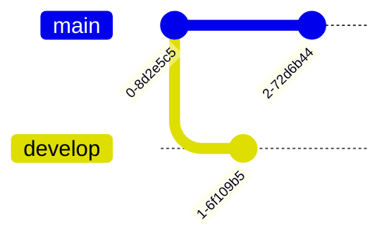

# Tutorials

- [Really slick space-themed](https://www.atlassian.com/git/tutorials/learn-git-with-bitbucket-cloud)
- [Learn git branching](https://learngitbranching.js.org/?locale=en_US) is a cool Javascript-based tutorial which visually explains some intermediate aspects of git.

# Rebasing

In its most basic form `git rebase <destination>` takes the commit where `HEAD` is located, finds the closest common ancestor with `<destination>`, takes all the commits after that ancestor which lead up to `HEAD` (including `HEAD` itself!) and attaches them to `<destination>`.
For example, 



# Creating a documentation branch

First have to checkout a branch which has basically no content.
To see the first commits:
``` bash
git log --reverse
```
The output should look something like:
```
commit f08827d194c9b25f1f6502148cc4797753798207
Author: Lucas Myers <lucasmyers97@gmail.com>
Date:   Tue Dec 28 12:42:56 2021 -0600
```
You checkout that commit (only need the first few characters) in order to get close to a blank slate:
``` bash
git checkout 
f08827d
```
Finally, 
